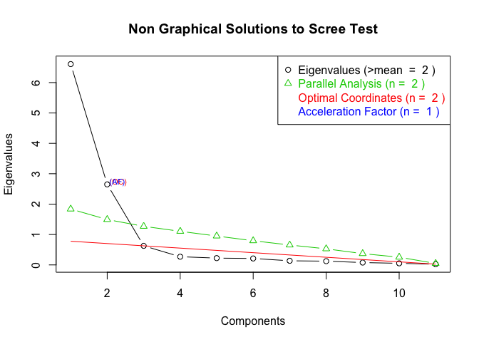
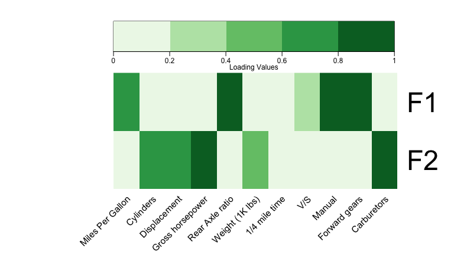

<!-- README.md is generated from README.Rmd. Please edit that file -->
Factor analysis visualization made easy with FAtools
====================================================

[](https://travis-ci.org/mattkcole/FAtools) [](https://ci.appveyor.com/project/mattkcole/FAtools) [](https://codecov.io/github/mattkcole/FAtools?branch=master)

### NOTE: THIS PACKAGE IS IN DEVELOPMENT

From choosing the numbers of factors to extract to inspecting loadings, factor analysis can be very visual in nature. The FAtools R package aims to make this process easier by providing functions to do visualizations with ease.

### To Download:

``` r
library('devtools')
#devtools::install_github('mattkcole/FAtools')
library('FAtools')
```

### Examples:

We can first look at our data (here we are using the possibly cliche but familiar data, mtcars).

``` r
library(datasets)
summary(mtcars)
#>       mpg             cyl             disp             hp       
#>  Min.   :10.40   Min.   :4.000   Min.   : 71.1   Min.   : 52.0  
#>  1st Qu.:15.43   1st Qu.:4.000   1st Qu.:120.8   1st Qu.: 96.5  
#>  Median :19.20   Median :6.000   Median :196.3   Median :123.0  
#>  Mean   :20.09   Mean   :6.188   Mean   :230.7   Mean   :146.7  
#>  3rd Qu.:22.80   3rd Qu.:8.000   3rd Qu.:326.0   3rd Qu.:180.0  
#>  Max.   :33.90   Max.   :8.000   Max.   :472.0   Max.   :335.0  
#>       drat             wt             qsec             vs        
#>  Min.   :2.760   Min.   :1.513   Min.   :14.50   Min.   :0.0000  
#>  1st Qu.:3.080   1st Qu.:2.581   1st Qu.:16.89   1st Qu.:0.0000  
#>  Median :3.695   Median :3.325   Median :17.71   Median :0.0000  
#>  Mean   :3.597   Mean   :3.217   Mean   :17.85   Mean   :0.4375  
#>  3rd Qu.:3.920   3rd Qu.:3.610   3rd Qu.:18.90   3rd Qu.:1.0000  
#>  Max.   :4.930   Max.   :5.424   Max.   :22.90   Max.   :1.0000  
#>        am              gear            carb      
#>  Min.   :0.0000   Min.   :3.000   Min.   :1.000  
#>  1st Qu.:0.0000   1st Qu.:3.000   1st Qu.:2.000  
#>  Median :0.0000   Median :4.000   Median :2.000  
#>  Mean   :0.4062   Mean   :3.688   Mean   :2.812  
#>  3rd Qu.:1.0000   3rd Qu.:4.000   3rd Qu.:4.000  
#>  Max.   :1.0000   Max.   :5.000   Max.   :8.000
```

Let's first make our correlation matrix - we wont worry about scaling or investigating our data much for this demonstration (usually a bad idea).

``` r
corr.matrix <- cor(mtcars)
```

Let's load the packages we need for our analysis:

``` r
library('psych')
library('FAtools')
library('dplyr')
library('knitr')
```

Lets make and plot our scree plot to assess the number of factors present.

``` r
s.plot <- FAtools::scree_plot(corr.matrix, nrow(mtcars), ncol(mtcars))
plot(s.plot)
```



We can conduct our factor analysis with two factors using the psych package.

``` r
results <- psych::fa(corr.matrix, 2, rotate = "varimax")
results$loadings
#> 
#> Loadings:
#>      MR2    MR1   
#> mpg   0.680 -0.607
#> cyl  -0.634  0.728
#> disp -0.729  0.609
#> hp   -0.330  0.872
#> drat  0.811 -0.222
#> wt   -0.799  0.430
#> qsec -0.152 -0.894
#> vs    0.299 -0.801
#> am    0.904       
#> gear  0.872  0.136
#> carb         0.800
#> 
#>                  MR2   MR1
#> SS loadings    4.495 4.369
#> Proportion Var 0.409 0.397
#> Cumulative Var 0.409 0.806
```

The loadings look pretty good, but we can make them more interpretable by excluding low loadings (param: `cutoff`), rounding (param: `roundto`), incorporate a data dictionary, and include labels -- And we can use the knitr::kable() function for great looking tables in Rmarkdown documents.

``` r
FAtools::loadings_table(results$loadings, 2, cutoff = 0.3, roundto = 2) %>%
        kable()
```

|      | V1    | V2    | Name |
|------|:------|:------|:-----|
| mpg  | 0.68  | -0.61 | mpg  |
| cyl  | -0.63 | 0.73  | cyl  |
| disp | -0.73 | 0.61  | disp |
| hp   | -0.33 | 0.87  | hp   |
| drat | 0.81  |       | drat |
| wt   | -0.8  | 0.43  | wt   |
| qsec |       | -0.89 | qsec |
| vs   | 0.3   | -0.8  | vs   |
| am   | 0.9   |       | am   |
| gear | 0.87  |       | gear |
| carb |       | 0.8   | carb |

Say we had more informative names than `colnames(mtcars)`.

``` r
cool_names <- c("Miles Per Gallon", "Cylinders", "Displacement",
                "Gross horsepower", "Rear Axle ratio", "Weight (1K lbs)",
                "1/4 mile time", "V/S", "Manual", "Forward gears",
                "Carburetors")
```

And say we wern't really all that interested in loadings with an absolute value less than 0.3.

``` r
FAtools::loadings_table(loading_frame = results$loadings, loadings_no = 2,
                        cutoff = 0.3, roundto = 2,
                        Name = colnames(mtcars), 
                        Description = cool_names) %>%
        kable()
```

| V1    | V2    | Description      |
|:------|:------|:-----------------|
| 0.68  | -0.61 | Miles Per Gallon |
| -0.63 | 0.73  | Cylinders        |
| -0.73 | 0.61  | Displacement     |
| -0.33 | 0.87  | Gross horsepower |
| 0.81  |       | Rear Axle ratio  |
| -0.8  | 0.43  | Weight (1K lbs)  |
|       | -0.89 | 1/4 mile time    |
| 0.3   | -0.8  | V/S              |
| 0.9   |       | Manual           |
| 0.87  |       | Forward gears    |
|       | 0.8   | Carburetors      |

We could also display this graphically, which works well when we have more retained factors or many more variables. (let's say we have 5 factors extracted).

``` r
loadings5 <- cor(mtcars) %>%
        psych::fa(2, rotate = "varimax")
        
FAtools::loadings_plot(loadings5$loadings,
                       colorbreaks = c(0, 0.2, 0.4, 0.6, 0.8, 1),
                       labRow = c("F1", "F2"),
                       columnlabels = cool_names)
#> Warning in if (is.na(labRow) == T) {: the condition has length > 1 and only
#> the first element will be used
```



Looks great!

Submit and issue with any concerns!

Credits: Much of the scree plot functionality comes from code provided by: [www.statmethods.net](http://www.statmethods.net/advstats/)
