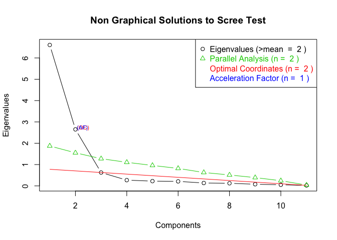

Factor analysis visualization made easy with FAtools
====================================================

[](https://travis-ci.org/mattkcole/FAtools)

From choosing the numbers of factors to extract to inspecting loadings, factor analysis can be very visual in nature. The FAtools R package aims to make this process easier by providing functions to do visualizations with ease.

### To Download:

``` r
library('devtools')
devtools::install_github('mattkcole/FAtools')
library('FAtools')
```

### Examples:

We can first look at our data (here we are using the possibly cliche but familiar data, mtcars).

``` r
library(datasets)
summary(mtcars)
```

    ##       mpg             cyl             disp             hp       
    ##  Min.   :10.40   Min.   :4.000   Min.   : 71.1   Min.   : 52.0  
    ##  1st Qu.:15.43   1st Qu.:4.000   1st Qu.:120.8   1st Qu.: 96.5  
    ##  Median :19.20   Median :6.000   Median :196.3   Median :123.0  
    ##  Mean   :20.09   Mean   :6.188   Mean   :230.7   Mean   :146.7  
    ##  3rd Qu.:22.80   3rd Qu.:8.000   3rd Qu.:326.0   3rd Qu.:180.0  
    ##  Max.   :33.90   Max.   :8.000   Max.   :472.0   Max.   :335.0  
    ##       drat             wt             qsec             vs        
    ##  Min.   :2.760   Min.   :1.513   Min.   :14.50   Min.   :0.0000  
    ##  1st Qu.:3.080   1st Qu.:2.581   1st Qu.:16.89   1st Qu.:0.0000  
    ##  Median :3.695   Median :3.325   Median :17.71   Median :0.0000  
    ##  Mean   :3.597   Mean   :3.217   Mean   :17.85   Mean   :0.4375  
    ##  3rd Qu.:3.920   3rd Qu.:3.610   3rd Qu.:18.90   3rd Qu.:1.0000  
    ##  Max.   :4.930   Max.   :5.424   Max.   :22.90   Max.   :1.0000  
    ##        am              gear            carb      
    ##  Min.   :0.0000   Min.   :3.000   Min.   :1.000  
    ##  1st Qu.:0.0000   1st Qu.:3.000   1st Qu.:2.000  
    ##  Median :0.0000   Median :4.000   Median :2.000  
    ##  Mean   :0.4062   Mean   :3.688   Mean   :2.812  
    ##  3rd Qu.:1.0000   3rd Qu.:4.000   3rd Qu.:4.000  
    ##  Max.   :1.0000   Max.   :5.000   Max.   :8.000

Let's first make our correlation matrix - we wont worry about scaling or investigating our data much for this demonstration (usually a bad idea).

``` r
corr.matrix <- cor(mtcars)
```

Let's load the packages we need for our analysis:

``` r
library(psych)
library(FAtools)
```

Lets make and plot our scree plot to assess the number of factors present.

``` r
s.plot <- FAtools::scree_plot(corr.matrix, nrow(mtcars), ncol(mtcars))
plot(s.plot)
```



We can conduct our factor analysis with two factors using the psych package.

``` r
results <- psych::fa(corr.matrix, 2)
```

    ## Loading required namespace: GPArotation

``` r
results$loadings
```

    ##
    ## Loadings:
    ##      MR1    MR2   
    ## mpg  -0.557  0.581
    ## cyl   0.688 -0.510
    ## disp  0.554 -0.630
    ## hp    0.869 -0.171
    ## drat -0.143  0.789
    ## wt    0.360 -0.736
    ## qsec -0.944 -0.328
    ## vs   -0.799  0.152
    ## am    0.176  0.942
    ## gear  0.234  0.920
    ## carb  0.835  0.201
    ##
    ##                  MR1   MR2
    ## SS loadings    4.309 4.093
    ## Proportion Var 0.392 0.372
    ## Cumulative Var 0.392 0.764

The loadings look pretty good, but we can make them more interpretable by excluding low loadings and including labels - And we can use the knitr::kable() function for great looking tables.

``` r
library(knitr)
```

``` r
awesometable <- FAtools::loadings_table(results$loadings, 2)
kable(awesometable)
```

|      | V1     | V2     | Name |
|------|:-------|:-------|:-----|
| mpg  | -0.557 | 0.581  | mpg  |
| cyl  | 0.688  | -0.51  | cyl  |
| disp | 0.554  | -0.63  | disp |
| hp   | 0.869  |        | hp   |
| drat |        | 0.789  | drat |
| wt   | 0.36   | -0.736 | wt   |
| qsec | -0.944 | -0.328 | qsec |
| vs   | -0.799 |        | vs   |
| am   |        | 0.942  | am   |
| gear | 0.234  | 0.92   | gear |
| carb | 0.835  | 0.201  | carb |

Submit and issue with any concerns!

Credits: Much of the scree plot functionality comes from code provided by: [www.statmethods.net](http://www.statmethods.net/advstats/factor.html)
